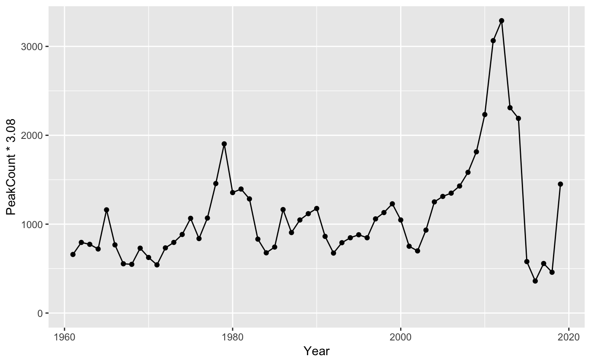

<!-- README.md is generated from README.Rmd. Please edit that file -->

[](https://www.tidyverse.org/lifecycle/#maturing)
[](https://travis-ci.org/poissonconsulting/kootlake)
[](https://ci.appveyor.com/project/poissonconsulting/kootlake)
[](https://codecov.io/github/poissonconsulting/kootlake?branch=master)
[](https://creativecommons.org/licenses/by-sa/4.0/)
[](https://doi.org/10.5281/zenodo.596654)

# Kootenay Lake Data

`kootlake` is an R package of annual Rainbow Trout, Bull Trout and
Kokanee datasets for Kootenay Lake. The data is provided by the Ministry
of Forests, Lands and Natural Resources Operations, British Columbia.

It provides a data set of individual fish length, weight, sex and
fecundity information.

``` r
library(tibble)
library(kootlake)
kootlake::fish
#> # A tibble: 1,843 x 12
#>     Year Month   Day Species Length Weight Sex   Fecundity Location
#>    <dbl> <dbl> <dbl> <chr>    <dbl>  <dbl> <chr>     <dbl> <chr>   
#>  1  1966     1     2 RB         580    2.8 <NA>         NA <NA>    
#>  2  1966     1     5 RB         650    3.6 <NA>         NA <NA>    
#>  3  1966     1     7 RB         420    0.8 <NA>         NA <NA>    
#>  4  1966     1     8 RB         600    3.1 <NA>         NA <NA>    
#>  5  1966     1     8 RB         630    3.6 <NA>         NA <NA>    
#>  6  1966     1    15 RB         710    4.6 <NA>         NA <NA>    
#>  7  1966     1    18 RB         737    6.4 <NA>         NA <NA>    
#>  8  1966     1    18 RB         620    3   <NA>         NA <NA>    
#>  9  1966     1    22 RB         500    1.7 <NA>         NA <NA>    
#> 10  1966     1    30 RB         680    5.2 <NA>         NA <NA>    
#> # … with 1,833 more rows, and 3 more variables: SampleID <dbl>,
#> #   Source <chr>, Comment <chr>
```

As well as data sets of annual counts for each species (`bulltrout`,
`kokanee` and `gerrard`) and annual `fishery` and `fishery_catch`
information from the Kootenay Lake Rainbow Trout mail out survey (KLRT).

It also provides the `kl_estimate_na()` function to estimate missing
variable values from a predictor using a linear model. By default it
estimates missing Bull Trout redd counts for Kaslo Creek using the
resistivity counter counts.

## Demonstration

``` r
library(ggplot2)

ggplot(data = kootlake::gerrard, aes(x = Year, y = PeakCount * 3.08)) + 
  geom_line() + 
  geom_point() + 
  expand_limits(y = 0)
```

<!-- -->

## Installation

To install the latest development version from
[GitHub](https://github.com/poissonconsulting/kootlake)

    # install.packages("devtools")
    devtools::install_github("poissonconsulting/kootlake")

To install the latest development version from the Poisson drat
[repository](https://github.com/poissonconsulting/drat)

    # install.packages("drat")
    drat::addRepo("poissonconsulting")
    install.packages("kootlake")

## Contribution

Please report any
[issues](https://github.com/poissonconsulting/kootlake/issues).

[Pull requests](https://github.com/poissonconsulting/kootlake/pulls) are
always welcome.

Please note that this project is released with a [Contributor Code of
Conduct](CONDUCT.md). By participating in this project you agree to
abide by its terms.
