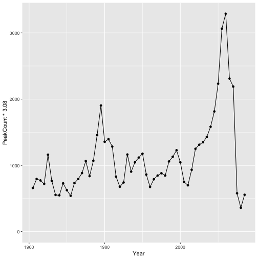

<!-- README.md is generated from README.Rmd. Please edit that file -->

[](https://www.tidyverse.org/lifecycle/#maturing)
[](https://travis-ci.org/poissonconsulting/kootlake)
[](https://ci.appveyor.com/project/poissonconsulting/kootlake)
[](https://codecov.io/github/poissonconsulting/kootlake?branch=master)
[](https://creativecommons.org/licenses/by-sa/4.0/)
[](https://doi.org/10.5281/zenodo.596654)

# Kootenay Lake Data

`kootlake` is an R package of annual Rainbow Trout, Bull Trout and
Kokanee datasets for Kootenay Lake. The data is provided by the Ministry
of Forests, Lands and Natural Resources Operations, British Columbia.

It includes the `kl_estimate_na()` function to estimate missing variable
values from a predictor using a linear model. By default it estimates
missing Bull Trout redd counts for Kaslo Creek using the resistivity
counter counts.

## Demonstration

``` r
library(ggplot2)

ggplot(data = kootlake::gerrard, aes(x = Year, y = PeakCount * 3.08)) + 
  geom_line() + 
  geom_point() + 
  expand_limits(y = 0)
```

<!-- -->

## Installation

`kootlake` is available from GitHub

    # install.packages("devtools")
    devtools::install_github("poissonconsulting/kootlake")

## Contribution

Please report any
[issues](https://github.com/poissonconsulting/kootlake/issues).

[Pull requests](https://github.com/poissonconsulting/kootlake/pulls) are
always welcome.

Please note that this project is released with a [Contributor Code of
Conduct](CONDUCT.md). By participating in this project you agree to
abide by its terms.
