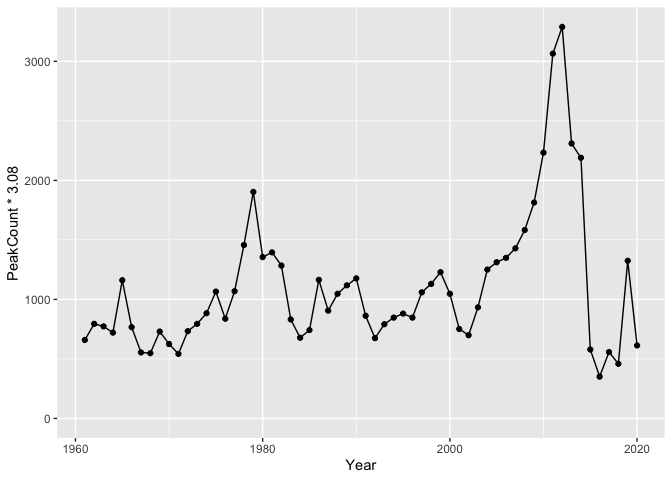

<!-- README.md is generated from README.Rmd. Please edit that file -->

<!-- badges: start -->

[](https://www.tidyverse.org/lifecycle/#maturing)
[](https://github.com/poissonconsulting/kootlake/actions)
[](https://codecov.io/gh/poissonconsulting/kootlake?branch=master)
[](https://opensource.org/licenses/Apache-2.0)
<!-- badges: end -->

# Kootenay Lake Data

`kootlake` is an R package of annual Rainbow Trout, Bull Trout and
Kokanee datasets for Kootenay Lake. The data is provided by the Ministry
of Forests, Lands and Natural Resources Operations, British Columbia.

It provides a data set of individual fish length, weight, sex and
fecundity information.

``` r
library(tibble)
#> Warning: package 'tibble' was built under R version 3.6.3
library(kootlake)
kootlake::fish
#> # A tibble: 1,843 x 12
#>     Year Month   Day Species Length Weight Sex   Fecundity Location SampleID
#>    <dbl> <dbl> <dbl> <chr>    <dbl>  <dbl> <chr>     <dbl> <chr>       <dbl>
#>  1  1966     1     2 RB         580    2.8 <NA>         NA <NA>          113
#>  2  1966     1     5 RB         650    3.6 <NA>         NA <NA>          165
#>  3  1966     1     7 RB         420    0.8 <NA>         NA <NA>          136
#>  4  1966     1     8 RB         600    3.1 <NA>         NA <NA>          151
#>  5  1966     1     8 RB         630    3.6 <NA>         NA <NA>          131
#>  6  1966     1    15 RB         710    4.6 <NA>         NA <NA>          163
#>  7  1966     1    18 RB         737    6.4 <NA>         NA <NA>          107
#>  8  1966     1    18 RB         620    3   <NA>         NA <NA>          149
#>  9  1966     1    22 RB         500    1.7 <NA>         NA <NA>          144
#> 10  1966     1    30 RB         680    5.2 <NA>         NA <NA>          117
#> # ... with 1,833 more rows, and 2 more variables: Source <chr>, Comment <chr>
```

As well as data sets of annual counts for each species (`bulltrout`,
`kokanee` and `gerrard`) and annual `fishery` and `fishery_catch`
information from the Kootenay Lake Rainbow Trout mail out survey (KLRT).

## Demonstration

``` r
library(ggplot2)
#> Warning: package 'ggplot2' was built under R version 3.6.3

ggplot(data = kootlake::gerrard, aes(x = Year, y = PeakCount * 3.08)) + 
  geom_line() + 
  geom_point() + 
  expand_limits(y = 0)
```



## Installation

To install the latest development version from
[GitHub](https://github.com/poissonconsulting/kootlake)

``` r
# install.packages("remotes")
remotes::install_github("poissonconsulting/kootlake")
```

## Contribution

Please report any
[issues](https://github.com/poissonconsulting/kootlake/issues).

[Pull requests](https://github.com/poissonconsulting/kootlake/pulls) are
always welcome.

## Code of Conduct

Please note that the kootlake project is released with a [Contributor
Code of
Conduct](https://contributor-covenant.org/version/2/0/CODE_OF_CONDUCT.html).
By contributing to this project, you agree to abide by its terms.

## License

The data files are licensed under the [Open Government Licence - British
Columbia](https://raw.githubusercontent.com/poissonconsulting/fishbc/master/data-raw/cdc/LICENSE.OGL-BCv2.0).

The code in this repository is licensed under the Apache License 2.0:

    Copyright 2019 Province of British Columbia
    
    Licensed under the Apache License, Version 2.0 (the "License");
    you may not use this file except in compliance with the License.
    You may obtain a copy of the License at
    
        http://www.apache.org/licenses/LICENSE-2.0
    
    Unless required by applicable law or agreed to in writing, software
    distributed under the License is distributed on an "AS IS" BASIS,
    WITHOUT WARRANTIES OR CONDITIONS OF ANY KIND, either express or implied.
    See the License for the specific language governing permissions and
    limitations under the License.
