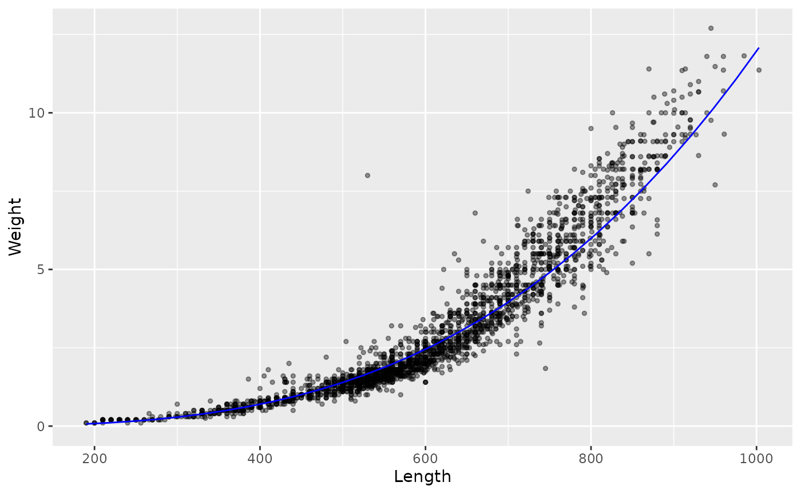
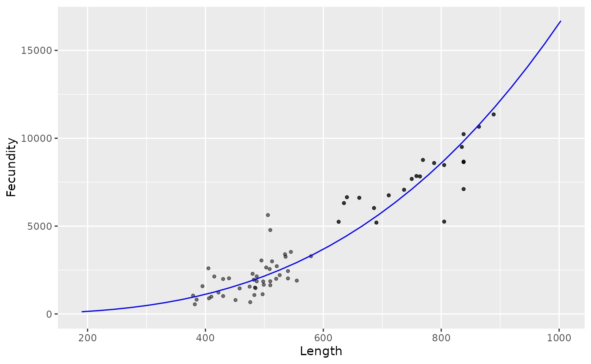
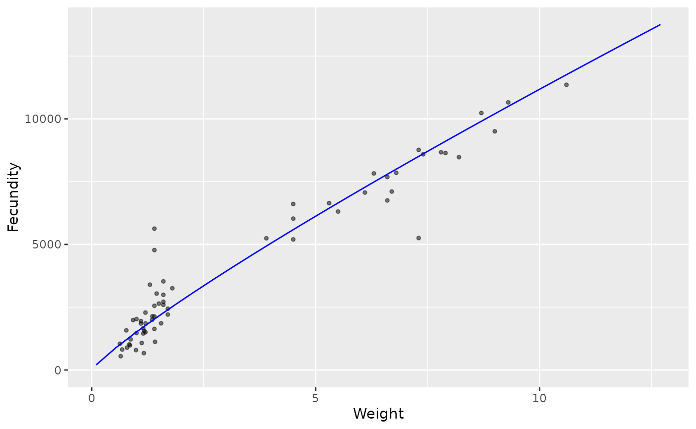

# Allometry of Kootenay Lake Rainbow Trout

Here we plot relationships between Rainbow Trout metrics and fit a
linear model to estimate the allometric ralationships for:

## Weight vs Length

``` r

library(ggplot2)
library(broom)

fish <- kootlake::fish

is.na(fish$Weight[is.na(fish$Weight) | fish$Weight == 0]) <- TRUE

WL_mod <- lm(log(Weight) ~ log(Length), data = fish)
WL_data <- data.frame(Length = seq(min(fish$Length), max(fish$Length), length.out = 30L))
WL_data$Weight <- exp(predict(WL_mod, newdata = WL_data))

ggplot(data = fish, aes(x = Length, y = Weight)) +
  geom_point(alpha = 0.4, size = 1) +
  geom_line(data = WL_data, col = "blue") +
  expand_limits(y = 0)
```



``` r


tidy(WL_mod, conf.int = TRUE)
#> # A tibble: 2 × 7
#>   term        estimate std.error statistic p.value conf.low conf.high
#>   <chr>          <dbl>     <dbl>     <dbl>   <dbl>    <dbl>     <dbl>
#> 1 (Intercept)   -19.0     0.0954     -199.       0   -19.1     -18.8 
#> 2 log(Length)     3.10    0.0150      207.       0     3.07      3.13
```

## Fecundity vs Length

``` r

FL_mod <- lm(log(Fecundity) ~ log(Length), data = fish)

FL_data <- data.frame(Length = seq(min(fish$Length), max(fish$Length), length.out = 30L))
FL_data$Fecundity <- exp(predict(FL_mod, newdata = FL_data))

ggplot(data = fish, aes(x = Length, y = Fecundity)) +
  geom_point(alpha = 0.5, size = 1) +
  geom_line(data = FL_data, col = "blue") +
  expand_limits(y = 0)
```



``` r


tidy(FL_mod, conf.int = TRUE)
#> # A tibble: 2 × 7
#>   term        estimate std.error statistic  p.value conf.low conf.high
#>   <chr>          <dbl>     <dbl>     <dbl>    <dbl>    <dbl>     <dbl>
#> 1 (Intercept)   -10.6      0.847     -12.5 4.87e-21   -12.3      -8.91
#> 2 log(Length)     2.94     0.132      22.2 2.20e-37     2.68      3.20
```

## Fecundity vs Weight

``` r

FW_mod <- lm(log(Fecundity) ~ log(Weight), data = fish)

FW_data <- data.frame(Weight = seq(min(fish$Weight, na.rm = TRUE), max(fish$Weight, na.rm = TRUE), length.out = 30L))
FW_data$Fecundity <- exp(predict(FW_mod, newdata = FW_data))

ggplot(data = fish, aes(x = Weight, y = Fecundity)) +
  geom_point(alpha = 0.5, size = 1) +
  geom_line(data = FW_data, col = "blue") +
  expand_limits(y = 0)
```



``` r


tidy(FW_mod, conf.int = TRUE)
#> # A tibble: 2 × 7
#>   term        estimate std.error statistic  p.value conf.low conf.high
#>   <chr>          <dbl>     <dbl>     <dbl>    <dbl>    <dbl>     <dbl>
#> 1 (Intercept)    7.32     0.0537     136.  1.63e-77    7.22      7.43 
#> 2 log(Weight)    0.868    0.0464      18.7 5.82e-27    0.775     0.961
```
